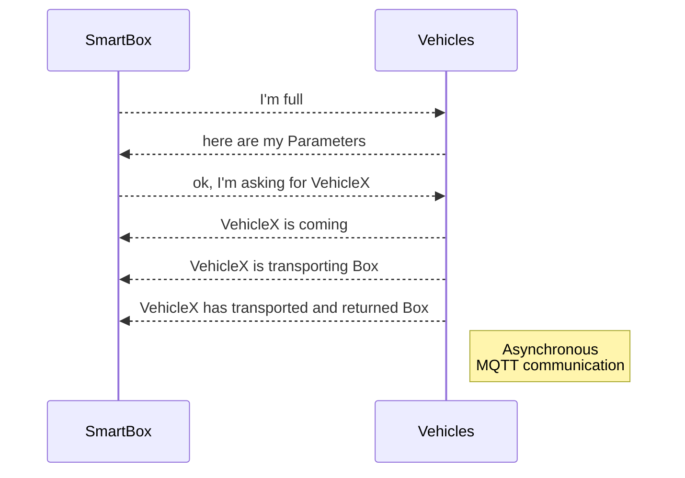

# Smart Box
The Code includes comments to give a better understanding of what is happening in the Code.

If you with to see some graphs and get more explanation, I'll refer to my documentation (ask [here](https://www.hsr.ch/) for permission).

The Code is written in C++ on the Framework Platformio (IDE: Visual Studio Code).

## Communication Model

