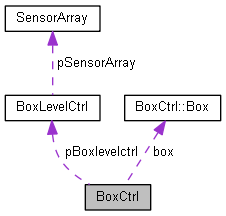

# SmartFactory_Box-Sortic

The SmartFactory_Box-Sortic is an implementation from the SmartFactory Project for Sortic.

SmartFactory_Box-Sortic is a SmartBox which can detect its fill level. It knows if it must be emptied or filled and communicates this information wirelessly to its environment using the [SmartFactory_MQTTCommunication](https://github.com/LMazzole/SmartFactory_MQTTCommunication)-component.

 Multiple nested Finite State Machines (FSM) based on the pattern of the [ArdFSM](<https://github.com/LMazzole/ArdFSM>) are used to control these processes.

<!-- add Pagebreak: 

 -->

## Table of Content

<!-- TOC Generated with https://magnetikonline.github.io/markdown-toc-generate/ -->

[TOC]

## The SmartFactory Project - Sortic

The implementation of the SmartFactory project for Sortic looks like this:

The associated  Repositorys are:  
  [SmartFactory-Sortic](https://github.com/LMazzole/SmartFactory-Sortic)  
  [SmartFactory_Box-Sortic](https://github.com/LMazzole/SmartFactory_Box-Sortic)  
  [SmartFactory_Vehicle-Sortic](https://github.com/LMazzole/SmartFactory_Vehicle-Sortic)  
  [SmartFactory_Vehicle-Basis](https://github.com/LMazzole/SmartFactory_Vehicle-Basis)  
  [SmartFactory_MQTTCommunication](https://github.com/LMazzole/SmartFactory_MQTTCommunication)  

## Tools and Technologies

The source code is written in C++.
To achieve this project, the following listed tools and technologies were used.

### Doxygen

Doxygen is used for the documentation of the source-code.  
An intorduction to *Doxygen* and how to install it can be found in the [ArdFSM-Repo](https://github.com/LMazzole/ArdFSM#documentation-with-doxygen).  

### VSCode PlatformIO

The used  IDE is [VSCode](https://code.visualstudio.com/) with the [PlatformIO](https://platformio.org/platformio-ide)-Extension.

### MQTT

For a description of the MQTT-Technologie take a look at the [MQTTCommunication-ReadMe](<https://github.com/LMazzole/SmartFactory_MQTTCommunication#mqtt>).   

# Documentation

## Hardware

 

To build a SmartBox the following hardware is needed:
* 1x [Adafruit Feather M0 WiFi - ATSAMD21 + ATWINC1500](https://www.adafruit.com/product/3010) from Adafruit.
* 1x LED + 560 Ohm Resistor
* 3x [Grove - Digital Distance Interrupter](http://wiki.seeedstudio.com/Grove-Digital_Distance_Interrupter_0.5_to_5cm-GP2Y0D805Z0F/)
* 1x Battery with an JST 2.0 Connection
* 1x [Box](<https://www.haneu.de/rasterplan-lagersichtkasten-gr-8-gelb.html>) (85 x 105 x 45 mm) with platform

For detailed building instructions please contact [Felix Nyffenegger](mailto:felix.nyffenegger@hsr.ch).

## Software

All functions and files are documented on the [GitHub-Page with Doxygen](https://lmazzole.github.io/SmartFactory_MQTTCommunication/).  
The documentation includes also the [MQTTCommunication](<https://github.com/LMazzole/SmartFactory_MQTTCommunication>)-Files.

It is important to mention that all functions are non-blocking and as short as possible so no other process slow down. This way a degree of parallelism can be achieved.

### Dependency Graph

    
    
Note: Click on image to open doxygen.

Extern Libraries:  

- [SmartFactory_MQTTCommunication](<https://github.com/LMazzole/SmartFactory_MQTTCommunication>)

### Collaboration Diagram

[]
(https://lmazzole.github.io/SmartFactory_Box-Sortic/class_box_ctrl.html)

### Important Functions and Files

#### MainConfiguration.h

In [MainConfiguration.h](https://lmazzole.github.io/SmartFactory_Box-Sortic/_main_configuration_8h.html) are all important settings for the Box defined:  

* How long the SmartBox for Vehicle-Responses waits (SMARTBOX_WAITFOR_VEHICLES_SECONDS)
* How long the SmartBox for Vehicle-Acknolegemnt  waits (SMARTBOX_ITERATION_VACKS_SECONDS)
* Time between the MQTT Publishs (TIME_BETWEEN_PUBLISH)
* The Hostname number (DEFAUL_HOSTNAME_NUMBER)
* The Hostname "SB"+ Hostnamenumber (DEFAULT_HOSTNAME)
* The maximum number of vehicles that will be evaluated (NUM_OF_MAXVALUES_VEHICLES_STORE)

#### SensorConfiguration.h

In [SensorConfiguration.h](<https://lmazzole.github.io/SmartFactory_Box-Sortic/_sensor_configuration_8h.html>) are all settings for the Sensors defined:

* Pin-number of the Distance-Interrupter
* Pin-number of the Load-Indicator LED

### Communication 

The SmartBox communicates via the [SmartFactory_MQTTCommunication](<https://github.com/LMazzole/SmartFactory_MQTTCommunication>) to an MQTT-Broker that distributes the messages. The communication works by subscribing to various topics. The subscribed topics change depending on action and position of the box. The TopicTree looks like this:

The box is constantly subscribed to the topics: *error, Box/error, Box/box.id/error* and also always publishes its status to *Box/box.id/status*. 

More information about the communication process and the complete procedure is documented in [SmartFactroy-Sortic-ReadMe](<https://github.com/LMazzole/SmartFactory-Sortic#smartfactory-sortic>). 

#### Handshake with Vehicle

For an handshake with a vehicle the topic *Box/box.id/handshake* is used. The confirmation of the new position is sent from the vehicle to the *Box/box.id/position*.

#### Sortic to Box

So that the box knows what it has loaded, it subscribes itself to the topic Sortic/Handover.  
It updated its loading information if a valid message is received.

## FAQ's

#### I'd like to use this code in my project. What do I need to know?  

> This repository is designed specifically for Sortic. You can still use it, if you follow the rules below:  
>
> * Use the same Handshake and Communication-Sequence for your carrier as documented in  [SmartFactory-Sortic](https://github.com/LMazzole/SmartFactory-Sortic) and [Communication](#communication).

### ToDo's
#### Hardware
- [ ] Only if a package is loaded or not is detected. It cannot be detected how full the box is, therefore the sensor concept has to be reworked.
- [ ] The battery of the box must be recharged by hand. Inductive charging while waiting would be desirable.
- [ ] Cable routing and mounting must be revised.
#### Software
All open ToDo's can be found in the Documentation on the [GitHub-Page](https://lmazzole.github.io/SmartFactory_Box-Sortic/todo.html)
- [ ] Split the Code in 2 Repos: Box-Sortic and Box-Basis in order to increase reusability.

## Contributors

- [Luca Mazzoleni](https://github.com/LMazzole)
- Luciano Bettinaglio

## Changelog

V 1.0	-	Release BA FS19	-	[Luca Mazzoleni](https://github.com/LMazzole)

## License

MIT License

