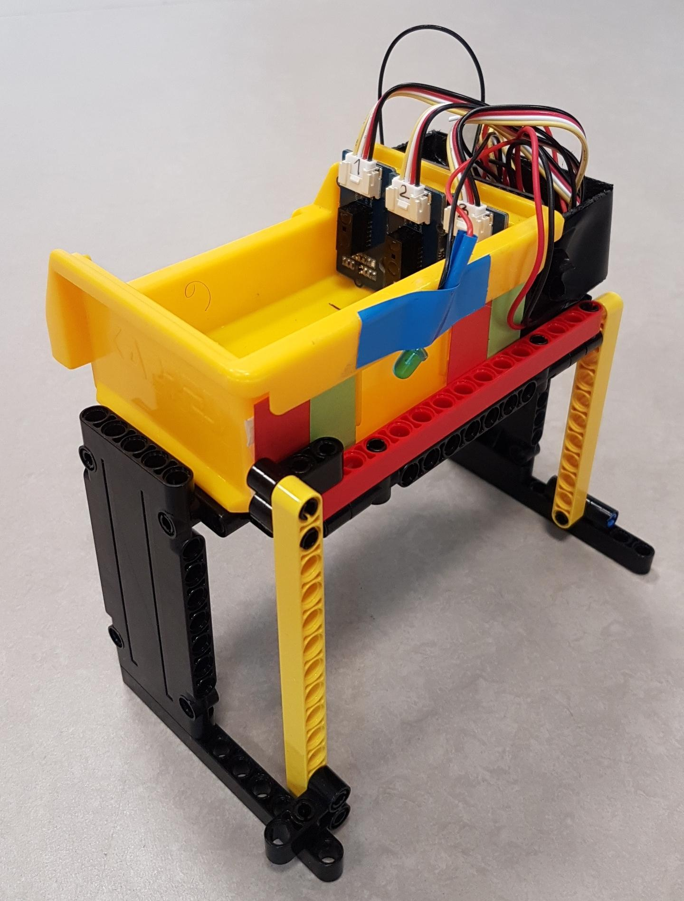

# SmartFactory_Box-Sortic

The SmartFactory_Box-Sortic is an implementation from the SmartFactory Project for Sortic.

SmartFactory_Box-Sortic is a SmartBox which can detect its fill level. It knows if it must be emptied or filled and communicates this information wirelessly to her environment using the [SmartFactory_MQTTCommunication](https://github.com/LMazzole/SmartFactory_MQTTCommunication)-component.

  An Finite State Machine (FSM) based on the pattern of the [ArdFSM](<https://github.com/LMazzole/ArdFSM>) is used to control the processes.

<!-- add Pagebreak: 

 -->

## Table of Content

<!-- TOC Generated with https://magnetikonline.github.io/markdown-toc-generate/ -->
- [The SmartFactroy Project - Sortic](#the-smartfactroy-project---sortic)
- [Tools and Technologies](#tools-and-technologies)
   - [Doxygen](#doxygen)
   - [VSCode PlatformIO](#vscode-platformio)
   - [MQTT](#mqtt)
- [Documentation](#documentation)
   - [Hardware](#hardware)
   - [Software](#software)
      - [Dependency Graph](#dependency-graph)
      - [Collaboration Diagram](#collaboration-diagram)
      - [Important Functions and Files](#important-functions-and-files)
         - [MainConfiguration.h](#mainconfigurationh)
         - [SensorConfiguration.h](#sensorconfigurationh)
      - [Communication](#communication)
   - [FAQ's](#faqs)
      - [I'd like to use this code in my project. What do I need to know?](#id-like-to-use-this-code-in-my-project-what-do-i-need-to-know)
   - [ToDo's](#todos)
      - [Hardware](#hardware-1) 	
      - [Software](#software-1)
   - [Contributors](#contributors)
   - [Changelog](#changelog)
- [License](#license)

## The SmartFactroy Project - Sortic

The implementation of the SmartFactory project  in Sortic looks like this:

The associated  Repositorys are:  
  [SmartFactory-Sortic](https://github.com/LMazzole/SmartFactory-Sortic)  
  [SmartFactory_Box-Sortic](https://github.com/LMazzole/SmartFactory_Box-Sortic)  
  [SmartFactory_Vehicle-Sortic](https://github.com/LMazzole/SmartFactory_Vehicle-Sortic)  
  [SmartFactory_Vehicle-Basis](https://github.com/LMazzole/SmartFactory_Vehicle-Basis)  
  [SmartFactory_MQTTCommunication](https://github.com/LMazzole/SmartFactory_MQTTCommunication)  

## Tools and Technologies

The Source-code is written in C++.
To achieve this project, the following listed tools and technologies were used.

### Doxygen

Doxygen is used for the documentation of the sourcecode.  
An intorduction to *Doxygen* and how to install it can be found in the [ArdFSM-Repo](https://github.com/LMazzole/ArdFSM#documentation-with-doxygen).  

### VSCode PlatformIO

The used  IDE is [VSCode](https://code.visualstudio.com/) with the [PlatformIO](https://platformio.org/platformio-ide)-Extension.

### MQTT

For a description of the MQTT-Technologie take a look at the [MQTTCommunication-ReadMe](<https://github.com/LMazzole/SmartFactory_MQTTCommunication#mqtt>).   

# Documentation

## Hardware

To build a SmartBox the following hardware is needed:
* 1x [Adafruit Feather M0 WiFi - ATSAMD21 + ATWINC1500](https://www.adafruit.com/product/3010) from Adafruit.
* 1x LED + 560 Ohm Resistor
* 3x [Grove - Digital Distance Interrupter](http://wiki.seeedstudio.com/Grove-Digital_Distance_Interrupter_0.5_to_5cm-GP2Y0D805Z0F/)
* 1x Battery with an JST 2.0 Connection
* 1x [Box](<https://www.haneu.de/rasterplan-lagersichtkasten-gr-8-gelb.html>) (85 x 105 x 45 mm) with platform

## Software

All functions and files are documented on the [GitHub-Page](https://lmazzole.github.io/SmartFactory_MQTTCommunication/).  
The Documentation includes also the [MQTTCommunication](<https://github.com/LMazzole/SmartFactory_MQTTCommunication>)-Files.

It's important to mention that all functions are non blocking and as short as possible so no other process starves.

### Dependency Graph

Extern Libraries:  

- [SmartFactory_MQTTCommunication](<https://github.com/LMazzole/SmartFactory_MQTTCommunication>)

### Collaboration Diagram

### Important Functions and Files

#### MainConfiguration.h

In MainConfiguration.h are all important settings for the Box defined:  

* How long the SmartBox for Vehicle-Responses waits (SMARTBOX_WAITFOR_VEHICLES_SECONDS)
* How long the SmartBox for Vehicle-Acknolegemnt  waits (SMARTBOX_ITERATION_VACKS_SECONDS)
* Time between the MQTT Publishs (TIME_BETWEEN_PUBLISH)
* The Hostname number (DEFAUL_HOSTNAME_NUMBER)
* The Hostname "SB"+ Hostnamenumber (DEFAULT_HOSTNAME)
* The maximum number of vehicles that will be evaluated (NUM_OF_MAXVALUES_VEHICLES_STORE)

#### SensorConfiguration.h

In SensorConfiguration.h are all settings for the Sensors defined:

* Pin-number of the Distance-Interrupter
* Pin-number of the Load-Indicator LED

### Communication 
Detailed information about the communication process between the Box and its surrounding are documented in the [SmartFactroy-Sortic-ReadMe](<https://github.com/LMazzole/SmartFactory-Sortic#smartfactory-sortic>).

## FAQ's

#### I'd like to use this code in my project. What do I need to know?  

> This Repository is specifically for Sortic. You can still use it, if you stick to the following rules:  
>
> * Use the same Handshake and Communication-Sequence for your carrier as documented in  [SmartFactory-Sortic](https://github.com/LMazzole/SmartFactory-Sortic).

### ToDo's
#### Hardware
- [ ] Only if a package is loaded or not is detected. It cannot be detected how full the box is. therefore the sensor concept has to be reworked.
- [ ] The battery of the box must be recharged by hand. Inductive charging while waiting would be desirable.
- [ ] Cable routing and mounting must be revised.
#### Software
The open ToDo's can be found in the Documentation on the [GitHub-Page](https://lmazzole.github.io/SmartFactory_Box-Sortic/todo.html)

### Contributors

[Luca Mazzoleni](https://github.com/LMazzole)

### Changelog

V 1.0	-	Release BA FS19	-	[Luca Mazzoleni](https://github.com/LMazzole)

## License

[TODO]

